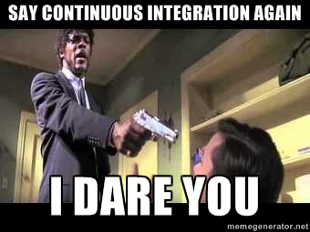

!SLIDE 
## What is Continuous Integration? 
 

!SLIDE bullets incremental transition=fade

# ...let's start with what is !CI #

* continuous deployment
* replacement for human eyes
* replacement for human testing / intervention 

!SLIDE transition=fade

## CI is **streamlined promotion** of the code through the *dev - test - production* lifecycle  

!SLIDE bullets incremental transition=fade

* ####continuous integration != continuous deployment

* ... cue the fire bait about what is CI and what is CD

* ... no really... 

* ... why would you ever want a robot to *continuously deploy* the **keys to your kingdom**?!

!SLIDE bullets incremental transition=fade

* ####continuous integration is *in addition* to human oversight & due diligence 

* ... again, this *is not* continuous deployment

!SLIDE bullets incremental transition=fade

* ####continuous integration *aids the QA pipeline*
	 
* ... in no way does it **replace** human QA oversight & due diligence
