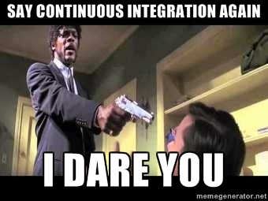

!SLIDE 
## Continuous Integration with Puppet  

!SLIDE transition=fade

 

(let's go over some terminology first)

!SLIDE transition=fade

## Continuous Integration

***streamlined promotion*** of code through *dev - test - production* 

!SLIDE transition=fade

## Continuous Delivery

CI ***with a human controlled*** realase gate to production.

!SLIDE transition=fade

## Continuous Deployment

CI ***with automated*** release gate to production

!SLIDE transition=fade

# The Theory of Constraints: #
## ***Any improvement*** made anywhere ***besides the bottleneck*** is an ***illusion***

!SLIDE bullets incremental transition=fade

# The Goal: 
* Automate things so it's **like a factory**.
* Then use **factory patterns** to ***solve your problems***.

!SLIDE transition=fade bullets incremental

## **Factory Constraints** = **Code Deployment Constraints**: 
* Deliver ***fast***, ***predictable***, and ***uninterrupted*** code pipelines 
* which ***minimize the time to production*** 
* by ***eliminating bottlenecks*** from the (agile) workflow. 

!SLIDE code transition=fade

<pre class="sh_Puppet">
class carFactory (
	$chassis,
	...
)inherits carFactory::params{	
	include carFactory::robots
	include carFactory::assemblyLine
	include carFactory::qualityAssurance
	...
}
</pre>

